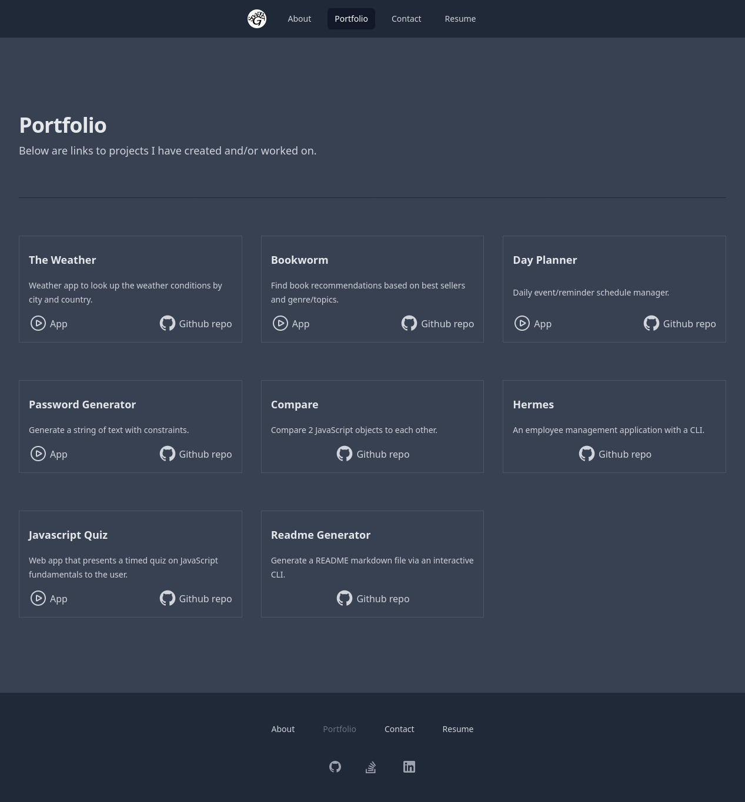
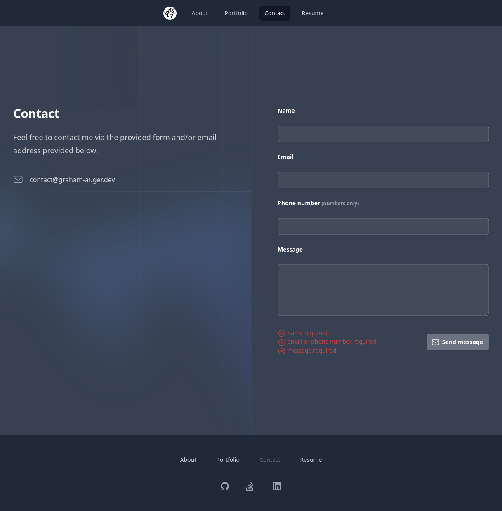
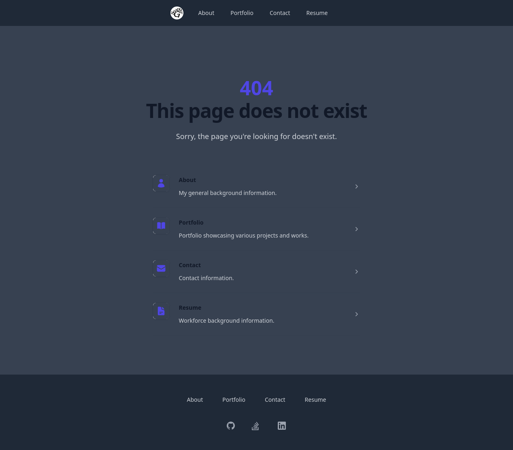

# Portfolio Client

Client frontend of my portfolio website. It contains 4 navigable pages and an
error page.

[![Node][node shield]][node website]
[![TypeScript][typescript shield]][typescript website]
[![react][react shield]][react website]
[![React Router][react router shield]][react router website]
[![SASS][sass shield]][sass website]
[![TailwindCSS][tailwind shield]][tailwind website]
[![Vite][vite shield]][vite website]
[![ESLint][eslint shield]][typescript eslint website]
[![npm][npm shield]][npm website]
![Git][git shield]
[![GitHub][github shield]][github repo]

## Table of Contents

- [Pages](#pages)
  - [About](#about-page)
  - [Portfolio](#portfolio-page)
  - [Contact](#contact-page)
  - [Resume](#resume-page)
  - [Error](#error-page)
- [Scripts](#scripts)

## Pages

### About page

The About page contains a short relatively candid description of myself and
interests and a little bit about my history.

### Portfolio page

The Portfolio page contains a list of projects I have worked on with short
descriptions of each project and links to their respective GitHub repositories
and deployed versions if applicable.

### Contact page

The Contact page provides a form that allows users to message me in addition to
an email address I can be contacted at. The form requires a name, an
email address and/or a phone number for reply purposes, and the message to be
sent to me.

### Resume page

The Resume page contains more specific information about which technologies I
have experience with, what features I implemented and was responsible for in
the projects I worked on, and my qualifications and work experience.

### Error page

The error page is displayed when a user navigates to a page that does not exist.

## Scripts

This package contains 4 scripts useful for development:

- `npm run dev`

    This script starts a local web server with hot module reloading.

- `npm run build`

    This script compiles the TypeScript source code and then has Vite bundle it
    into a production distributable ready format.

- `npm run lint`

    This script runs the linter using the ESLint on the TypeScript source code.

- `npm run preview`

    This script starts a local web server using the built production
    distributable ready bundle.

[node shield]: https://img.shields.io/badge/node.js-6DA55F?style=for-the-badge&logo=node.js&logoColor=white "node"
[node website]: https://nodejs.org/en/about "node"
[typescript shield]: https://img.shields.io/badge/typescript-%23007ACC.svg?style=for-the-badge&logo=typescript&logoColor=white "TypeScript"
[typescript website]: https://www.typescriptlang.org/ "TypeScript"
[sass shield]: https://img.shields.io/badge/SASS-hotpink.svg?style=for-the-badge&logo=SASS&logoColor=white "SASS"
[sass website]: https://sass-lang.com/ "SASS"
[react shield]: https://img.shields.io/badge/react-%2320232a.svg?style=for-the-badge&logo=react&logoColor=%2361DAFB "React"
[react website]: https://react.dev/ "React"
[react router shield]: https://img.shields.io/badge/React_Router-CA4245?style=for-the-badge&logo=react-router&logoColor=white "React Router"
[react router website]: https://www.npmjs.com/package/react-router "React Router"
[tailwind shield]: https://img.shields.io/badge/tailwindcss-%2338B2AC.svg?style=for-the-badge&logo=tailwind-css&logoColor=white "TailwindCSS"
[tailwind website]: https://tailwindcss.com "TailwindCSS"
[vite shield]: https://img.shields.io/badge/vite-%23646CFF.svg?style=for-the-badge&logo=vite&logoColor=white "Vite"
[vite website]: https://vitejs.dev "Vite"
[eslint shield]: https://img.shields.io/badge/ESLint-4B3263?style=for-the-badge&logo=eslint&logoColor=white "TypeScript ESLint"
[typescript eslint website]: https://typescript-eslint.io/ "TypeScript ESLint"
[npm shield]: https://img.shields.io/badge/NPM-%23CB3837.svg?style=for-the-badge&logo=npm&logoColor=white "npm"
[npm website]: https://www.npmjs.com/ "npm"
[git shield]: https://img.shields.io/badge/git-%23F05033.svg?style=for-the-badge&logo=git&logoColor=white "Git"
[github shield]: https://img.shields.io/badge/github-%23121011.svg?style=for-the-badge&logo=github&logoColor=white "github"
[github repo]: https://github.com/SnapperGee/portfolio-client "GitHub repo"
